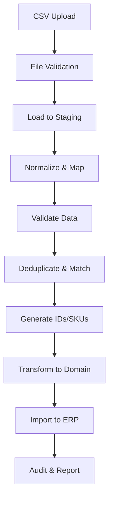

# Tally CSV Ingestion Architecture - Implementation Guide

## Overview

The Tally Ingestion Backend is a separate Spring Boot application designed to import CSV exports from Tally ERP into your main ERP system. It provides:

- **One-click CSV ingestion** from Tally exports
- **Deterministic ID generation** with cross-entity linking
- **Automatic SKU generation** with collision prevention
- **Data validation and reconciliation** with existing records
- **Batch processing** for large datasets
- **Audit logging** for compliance and debugging

## Architecture Components

### 1. Directory Structure
```
tally-ingestion-backend/
├── src/main/java/com/bigbrightpaints/tally/
│   ├── domain/                    # JPA entities
│   │   ├── BaseEntity.java       # Base with audit fields
│   │   ├── IngestionRun.java     # Run tracking
│   │   ├── IngestionFile.java    # File tracking
│   │   ├── IdRegistry.java       # Generated IDs
│   │   ├── SkuRegistry.java      # Generated SKUs
│   │   ├── staging/              # Staging entities
│   │   │   ├── StagingProduct.java
│   │   │   ├── StagingDealer.java
│   │   │   └── StagingAccount.java
│   │   └── mapping/              # Mapping configs
│   │       ├── BrandMapping.java
│   │       └── UomMapping.java
│   ├── repository/                # Data access
│   ├── service/                   # Business logic
│   │   ├── csv/                  # CSV processing
│   │   │   ├── CsvParser.java
│   │   │   └── CsvFileProcessor.java
│   │   ├── IdGenerationService.java
│   │   └── SkuGenerationService.java
│   ├── controller/                # REST endpoints
│   ├── config/                    # Configuration
│   └── util/                      # Utilities
└── src/main/resources/
    ├── application.yml            # App config
    └── db/migration/              # Flyway migrations
        └── V1__init_tally_ingestion.sql
```

### 2. Database Schema

#### Core Tables
- **tally_ingestion_runs**: Tracks each import run with statistics
- **tally_ingestion_files**: Tracks individual CSV files
- **tally_id_registry**: Stores generated deterministic IDs
- **tally_sku_registry**: Stores generated SKUs with collision tracking

#### Staging Tables
- **stg_tally_products**: Raw product data from CSV
- **stg_tally_dealers**: Raw dealer data (Sundry Debtors)
- **stg_tally_suppliers**: Raw supplier data (Sundry Creditors)
- **stg_tally_accounts**: Raw ledger/account data
- **stg_tally_inventory**: Raw stock positions
- **stg_tally_pricing**: Raw price lists

#### Mapping Tables
- **tally_brand_mappings**: Tally brand → canonical brand
- **tally_category_mappings**: Tally category → internal category
- **tally_uom_mappings**: Tally UOM → internal UOM
- **tally_ledger_mappings**: Tally ledger group → account type
- **tally_tax_mappings**: Tally GST rate → tax slab

#### Audit Tables
- **tally_reconciliation_matches**: Entity matching results
- **tally_ingestion_errors**: Processing errors
- **tally_ingestion_audit**: Change audit log

### 3. Processing Pipeline



### 4. ID Generation Strategy

#### Deterministic ID Generation
```java
// Dealer ID generation
Source Key: "DEALER:GSTIN:27AABCB1234D1ZE"
Hash: SHA-256(Source Key)
Generated ID: "BBP_DLR_A1B2C3D4E5F6"

// Product ID generation
Source Key: "PRODUCT:BRAND:SAPPHIRE:NAME:2IN1_EMULSION"
Generated ID: "BBP_PRD_F6E5D4C3B2A1"

// Variant ID generation
Source Key: "VARIANT:PRODUCT:BBP_PRD_123:COLOR:RED:SIZE:5L:PACK:1"
Generated ID: "BBP_VAR_9876543210AB"
```

#### Human-Readable Codes
```java
// Dealer code: Initials + City
"Bright Paints Delhi" → "BPDL01"

// Supplier code: Initials
"Asian Chemical Suppliers" → "ACS01"
```

### 5. SKU Generation Pattern

#### SKU Patterns by Brand
```yaml
SAPPHIRE: 'SAP-{BASE}-{COLOR}-{SIZE}-{PACK}-{SEQ}'
NEROLAC: 'NER-{BASE}-{COLOR}-{SIZE}-{SEQ}'
ASIAN: 'ASN-{BASE}-{COLOR}-{SIZE}-{SEQ}'
default: '{BRAND}-{BASE}-{COLOR}-{SIZE}-{SEQ}'
```

#### Example SKUs
```
Input: SAPPHIRE 2 IN 1 EMULSION RED 5L
SKU: SAP-EMUL-RED-5L

Input: NEROLAC ENAMEL WHITE 1L
SKU: NER-ENAM-WHT-1L

Collision: SAP-EMUL-RED-5L-01 (if duplicate)
```

### 6. CSV Processing Flow

```java
// 1. Upload endpoint receives file
POST /api/v1/ingestion/upload
Content-Type: multipart/form-data

// 2. Create ingestion run
IngestionRun run = new IngestionRun();
run.setRunType(RunType.FULL_IMPORT);
run.setCompanyId(companyId);

// 3. Process file in batches
csvParser.parseCsvInBatches(inputStream, batch -> {
    // Map to staging entities
    List<StagingProduct> products = mapToStaging(batch);

    // Save to staging tables
    stagingProductRepository.saveAll(products);
});

// 4. Validate staged data
validateProducts(run);

// 5. Generate IDs and SKUs
for (StagingProduct product : unprocessedProducts) {
    GeneratedId productId = idService.generateProductId(...);
    GeneratedSku sku = skuService.generateSku(...);
    product.setGeneratedSku(sku.sku());
}

// 6. Transform and import
transformToERP(run);
```

### 7. Validation Rules

#### Required Fields
- **Dealers**: Name, (GSTIN or PAN)
- **Suppliers**: Name, (GSTIN or PAN)
- **Products**: Stock item name, unit
- **Accounts**: Ledger name, ledger group

#### Format Validations
```java
// GSTIN format (Indian GST)
Pattern: ^[0-9]{2}[A-Z]{5}[0-9]{4}[A-Z]{1}[1-9A-Z]{1}Z[0-9A-Z]{1}$

// PAN format
Pattern: ^[A-Z]{5}[0-9]{4}[A-Z]{1}$

// Email format
Standard email validation

// Numeric ranges
Credit limit: 0 to 999999999
GST rate: 0, 5, 12, 18, 28
```

### 8. Reconciliation & Matching

#### Exact Match Fields
- GSTIN (highest priority)
- PAN
- Email
- Phone

#### Fuzzy Match
- Name similarity > 80% threshold
- Address similarity
- Levenshtein distance algorithm

#### Match Resolution
```java
public enum ResolutionAction {
    UPDATE,      // Update existing entity
    SKIP,        // Skip duplicate
    CREATE_NEW,  // Create as new entity
    MERGE        // Merge with existing
}
```

### 9. REST API Endpoints

```java
// Upload CSV files
POST /api/v1/ingestion/upload
{
    "companyId": 1,
    "runType": "FULL_IMPORT",
    "dryRun": false,
    "files": [multipart files]
}

// Get run status
GET /api/v1/ingestion/runs/{runId}

// Get processing errors
GET /api/v1/ingestion/runs/{runId}/errors

// Download error report
GET /api/v1/ingestion/runs/{runId}/errors/csv

// Manage mappings
GET/POST/PUT /api/v1/ingestion/mappings/brands
GET/POST/PUT /api/v1/ingestion/mappings/uom
GET/POST/PUT /api/v1/ingestion/mappings/categories

// Preview generated IDs/SKUs (dry run)
POST /api/v1/ingestion/preview
```

### 10. Integration with Main ERP

#### Direct Database Integration
```sql
-- After successful ingestion, data is available in ERP tables
INSERT INTO dealers (id, code, name, gstin, ...)
SELECT mapped_dealer_id, generated_dealer_code, party_name, gstin, ...
FROM stg_tally_dealers
WHERE run_id = ? AND processed = true;
```

#### API Integration
```java
// Call ERP backend APIs
@Service
public class ErpIntegrationService {

    public void createDealer(DealerDto dealer) {
        erpClient.post("/api/v1/sales/dealers", dealer);
    }

    public void createProduct(ProductDto product) {
        erpClient.post("/api/v1/production/products", product);
    }
}
```

### 11. Error Handling & Recovery

#### Error Types
- **VALIDATION**: Required field missing, format invalid
- **MAPPING**: Unknown category, brand, UOM
- **DUPLICATE**: Duplicate SKU, code collision
- **REFERENCE**: Foreign key constraint violation
- **TRANSFORMATION**: Data type conversion error

#### Recovery Options
1. **Fix and Retry**: Update mapping, fix data, re-run
2. **Skip and Continue**: Mark as skipped, process rest
3. **Manual Override**: Admin intervention required

### 12. Performance Optimizations

- **Batch Processing**: Process 1000 rows at a time
- **Parallel Processing**: Multi-threaded file processing
- **Caching**: Cache IDs, SKUs, mappings in memory
- **Indexing**: Database indexes on lookup columns
- **Bulk Operations**: Use batch inserts/updates

### 13. Monitoring & Metrics

```yaml
Metrics exposed via /management/prometheus:
- ingestion_runs_total
- ingestion_rows_processed
- ingestion_errors_total
- ingestion_duration_seconds
- sku_collisions_total
```

## Usage Examples

### 1. Basic CSV Upload
```bash
curl -X POST http://localhost:8081/api/v1/ingestion/upload \
  -H "X-Company-Id: 1" \
  -F "runType=FULL_IMPORT" \
  -F "products=@products.csv" \
  -F "dealers=@dealers.csv"
```

### 2. Dry Run (Preview)
```bash
curl -X POST http://localhost:8081/api/v1/ingestion/upload \
  -H "X-Company-Id: 1" \
  -F "runType=FULL_IMPORT" \
  -F "dryRun=true" \
  -F "products=@products.csv"
```

### 3. Check Run Status
```bash
curl http://localhost:8081/api/v1/ingestion/runs/abc123-def456
```

### 4. Download Error Report
```bash
curl http://localhost:8081/api/v1/ingestion/runs/abc123/errors/csv \
  -o errors.csv
```

## Running the Application

### Prerequisites
- Java 17+
- PostgreSQL 14+
- Maven 3.8+

### Setup
```bash
# Clone and navigate
cd tally-ingestion-backend

# Create database
createdb tally_ingestion

# Build
mvn clean package

# Run
java -jar target/tally-ingestion-backend-1.0.0-SNAPSHOT.jar

# Or with Maven
mvn spring-boot:run
```

### Configuration
```yaml
# Override in application-local.yml
spring:
  datasource:
    url: jdbc:postgresql://localhost:5432/tally_ingestion
    username: your_user
    password: your_password

tally:
  ingestion:
    company-prefix: YOUR_PREFIX
    storage:
      local:
        path: /path/to/uploads

erp:
  backend:
    url: http://localhost:8080
    api-key: your-api-key
```

## Security Considerations

1. **Authentication**: Integrate with your auth system
2. **Authorization**: Role-based access (ROLE_ADMIN, ROLE_IMPORT)
3. **Data Validation**: Strict input validation
4. **SQL Injection**: Using parameterized queries
5. **File Upload**: Size limits, virus scanning
6. **Audit Trail**: Complete audit logging
7. **Data Encryption**: Sensitive fields encrypted at rest

## Next Steps

1. **Add remaining services**: Validation, transformation, import writers
2. **Create REST controllers**: Upload, status, mapping management
3. **Implement batch jobs**: Spring Batch for large files
4. **Add integration tests**: Test complete pipeline
5. **Build UI dashboard**: Upload interface, monitoring
6. **Deploy with Docker**: Containerize the application
7. **Setup CI/CD**: Automated testing and deployment

This architecture provides a robust, scalable solution for importing Tally data with:
- **Reliability**: Idempotent operations, retry logic
- **Traceability**: Complete audit trail
- **Flexibility**: Configurable mappings and patterns
- **Performance**: Batch processing, caching
- **Maintainability**: Clean separation of concerns