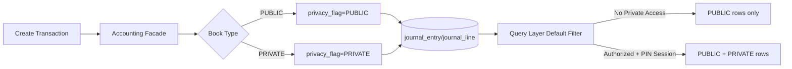
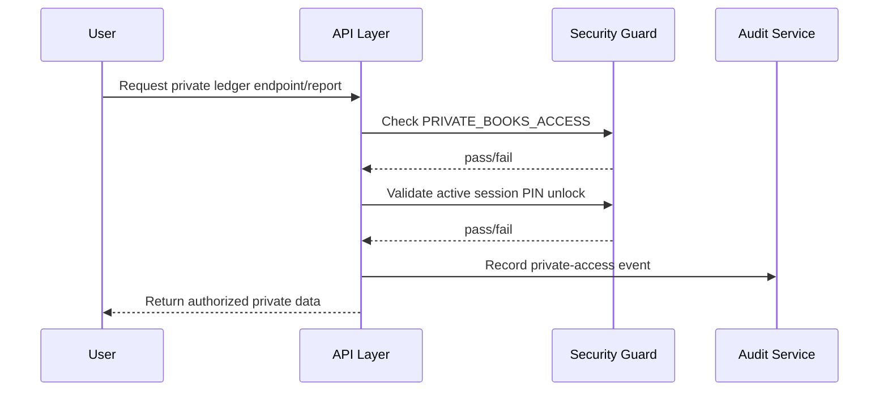

# Private Ledger Architecture Design (Dual-Book GST / Non-GST)

> **Status: NOT IMPLEMENTED**
>
> This document is an architecture/design proposal for a future release. No production code, schema migration, API, or UI behavior described below is currently deployed.

## 1) Problem statement

Some dealers need to run **both GST and non-GST transactions under the same tenant/company** for legitimate business reasons, for example:

- Mixed transaction channels (formal GST invoiced sales + informal/non-GST cash or legacy flows).
- Transitional compliance periods where historical and current records must coexist.
- Internal management reporting that must reconcile both public-compliance and restricted-private books.

Current model assumptions in ERP flows are single-book oriented for a tenant scope. That creates two risks:

1. **Operational friction**: teams are forced to split data across separate tenants, increasing duplicate setup, reconciliation overhead, and user confusion.
2. **Security risk**: if non-GST/private entries are stored in the same operational pathways without strict isolation, standard users/reports may accidentally view sensitive private-book data.

The goal is to support dual-book behavior in one tenant **without private data leakage** into standard accounting, operational queries, exports, and reports.

---

## 2) Data model options

### Option A: Flag-based model (`privacy_flag` on transactions/journal entries)

Add a privacy discriminator to book-bearing records, e.g.:

- `journal_entry.privacy_flag` (`PUBLIC` / `PRIVATE`)
- `journal_line.privacy_flag` (or inherited from parent entry)
- related accounting/reporting records carrying effective privacy state

#### Pros

- Minimal schema disruption; extends existing table model and posting pipelines.
- Leverages existing accounting flow (facade + journal lifecycle) with controlled branching.
- Easier cross-book reconciliation because data stays in one logical schema.
- Lower migration and operational complexity than introducing another schema boundary.

#### Cons

- Safety depends on strict query discipline; any missed filter can leak private rows.
- Existing repository/query surface area is large; rollout must be systematic.
- Requires strong defense-in-depth (default filters, endpoint guards, tests, audit).

### Option B: Separate shadow schema (e.g. `private_ledger.*`)

Store private-book records in a separate database schema/tables and integrate through service orchestration.

#### Pros

- Strong physical/logical separation; accidental query leakage is less likely.
- Independent index and storage tuning can be simpler for private workloads.
- Clear blast-radius isolation if access control fails at app layer.

#### Cons

- Significant duplication of posting, query, reconciliation, and report paths.
- High migration and maintenance overhead (dual schema evolution + dual code paths).
- Cross-book consolidated views become expensive and complex.
- Increased risk of drift between public/private processing logic.

### Comparative summary

| Criterion | Flag-based | Shadow schema |
|---|---|---|
| Implementation complexity | Medium | High |
| Operational overhead | Low-Medium | High |
| Isolation strength (by default) | Medium (needs app controls) | High |
| Reuse of current accounting flow | High | Low-Medium |
| Time to first usable release | Faster | Slower |

---

## 3) Recommended approach

### Recommendation: **Flag-based model with application-level query filtering**

Use `privacy_flag` as the canonical book discriminator and enforce access by default-deny query behavior.

Design principles:

1. **Single write model**: posting still goes through one accounting pathway, with explicit book classification.
2. **Default deny for private rows**: every standard read path excludes private data unless explicitly elevated.
3. **Elevated access is explicit and temporary**: requires both permission and session PIN state.
4. **Full auditability**: all private-read and private-write activities are logged as security/audit events.

---

## 4) Security model

Private book access requires **all** of the following:

1. **RBAC permission**: `PRIVATE_BOOKS_ACCESS`
2. **Session PIN verification**: user must unlock private mode for the current session/window.
3. **Audit trail**: every private data access event is recorded (who, when, what, why, trace/correlation id).

### Proposed access flow

### Audit requirements (minimum)

- Subject: user id, role set, tenant/company id.
- Request context: endpoint, HTTP method, correlation id/trace id, timestamp.
- Access scope: public/private mode, filters used, affected report/entity scope.
- Result: success/denied/failure reason.

---

## 5) Query isolation (prevent leakage in standard queries)

Standard queries must **never** return private rows unless access is explicitly elevated.

### Isolation controls

1. **Default WHERE clause policy**
   - Repository/query baseline includes `privacy_flag = 'PUBLIC'`.
   - Shared query helpers/specifications enforce this by default.

2. **Spring Security request filter / context guard**
   - Request-scoped security context resolves `privateAccessEnabled=true|false`.
   - Default is `false`.
   - Set to `true` only after RBAC + PIN checks pass.

3. **Endpoint-level segregation**
   - Standard endpoints always operate in public-only mode.
   - Private-capable endpoints explicitly opt in to private mode.

4. **Fail-closed behavior**
   - If security context is missing/invalid, query layer falls back to public-only.
   - Any ambiguity (missing PIN state, expired unlock, inconsistent claims) denies private scope.

### Verification strategy (future implementation)

- Contract tests asserting standard endpoints exclude `privacy_flag=PRIVATE` rows.
- Security tests verifying unauthorized/without-PIN requests receive 403/401.
- Regression suite for repository methods to ensure default filtering is never bypassed.

---

## 6) Reporting model

### Choice analysis

#### A) Separate private report endpoints
Example: `/api/v1/reports/private/*` (guarded by permission + PIN)

- **Pros**: very explicit security boundary, easier audit tagging, lower accidental exposure risk.
- **Cons**: duplicate endpoint surface and potential report logic reuse overhead.

#### B) Inline toggle on existing report endpoints
Example: `includePrivate=true` (only when authorized)

- **Pros**: fewer endpoints, consistent UX for users with authorization.
- **Cons**: greater leakage risk if toggle validation is missed at any layer.

### Recommended rollout

- **Phase 1**: use **separate private endpoints** for clearer boundary and safer hardening.
- **Phase 2**: optionally add inline toggle only after security/filter contracts are proven stable.

---

## 7) Database considerations

1. **Encryption at rest**
   - Keep database/disk-level encryption enabled for all data.
   - For highly sensitive private metadata, evaluate column-level encryption where needed.

2. **Index strategy**
   - Add privacy-aware indexes for common filtering patterns, e.g.:
     - `(company_id, privacy_flag, posting_date)`
     - `(company_id, privacy_flag, account_id)`
   - Consider partial indexes for `privacy_flag='PRIVATE'` if private volume is smaller but queried frequently.

3. **Storage and retention**
   - Private and public rows remain in same tables with strict discriminator usage.
   - Retention/audit policies should include private-access logs with immutable history semantics.

4. **Migration approach (future)**
   - Backward-compatible schema changes first (add columns + defaults).
   - Controlled backfill/classification scripts where legacy rows require tagging.

---

## 8) Implementation roadmap (phased, estimated effort)

| Phase | Scope | Estimated effort |
|---|---|---|
| Phase 0 | Finalize design, threat model, and acceptance criteria | 2-3 days |
| Phase 1 | Schema additions (`privacy_flag`), domain model updates, write-path tagging | 1-1.5 weeks |
| Phase 2 | Security controls (`PRIVATE_BOOKS_ACCESS`, session PIN unlock, audit events) | 1 week |
| Phase 3 | Query isolation rollout (default filters + Spring Security context integration) | 1-1.5 weeks |
| Phase 4 | Private reporting endpoints + validation suite + performance tuning/indexing | 1 week |
| Phase 5 | Pilot rollout, data validation, operational runbook, staged enablement | 0.5-1 week |

### Total estimate

**~5 to 6.5 weeks** (single team), excluding external compliance sign-off and multi-tenant rollout coordination.

### Delivery gates

- Gate A: No private leakage in standard endpoints/reports (automated contract tests).
- Gate B: Access requires RBAC + active PIN unlock (security tests).
- Gate C: Private access audit completeness verified for read/write/report/export actions.

---

## 9) Explicit status and deployment note

> **NOT IMPLEMENTED — DESIGN ONLY**
>
> The private ledger dual-book capability described here is planned for a future deployment. This repository change provides architecture guidance only and does not introduce runtime behavior changes at this time.
