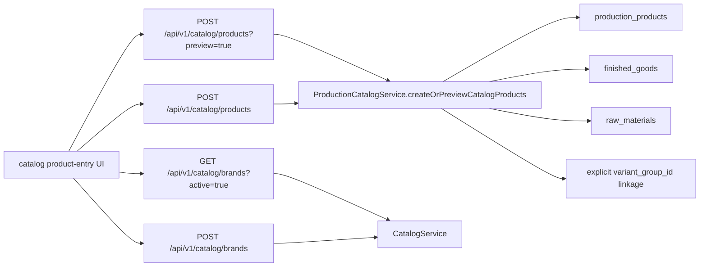

# Catalog Surface Consolidation

This folder is the packet handoff for the surviving public catalog contract.

## Purpose

Use this doc set to understand the post-consolidation truth:

- the only supported public catalog host is `/api/v1/catalog/**`
- brand creation is explicit on `POST /api/v1/catalog/brands`
- product preview and commit live on `POST /api/v1/catalog/products`
- product create consumes a pre-resolved active `brandId`
- retired `/api/v1/accounting/catalog/**`, `/api/v1/production/**`, and
  `/api/v1/catalog/products/bulk` surfaces are gone

## Doc Set

- [01-current-state-flow.md](./01-current-state-flow.md)
  Current runtime/catalog ownership after consolidation.
- [02-target-accounting-product-entry-flow.md](./02-target-accounting-product-entry-flow.md)
  The intended accounting-facing UX and API shape that now matches runtime.
- [03-definition-of-done-and-parallel-scope.md](./03-definition-of-done-and-parallel-scope.md)
  Contract-level acceptance criteria for this packet.
- [04-update-hygiene.md](./04-update-hygiene.md)
  Files that must stay aligned when the catalog contract changes.

## Surviving Public Contract

### Canonical brand flow

- `GET /api/v1/catalog/brands?active=true` for existing-brand selection
- `POST /api/v1/catalog/brands` for explicit new-brand creation

### Canonical product flow

- `GET /api/v1/catalog/products` for browse/search
- `POST /api/v1/catalog/products?preview=true` for non-mutating candidate
  planning
- `POST /api/v1/catalog/products` for commit using the same request shape

### Rules

- product create requires an active `brandId`
- inline brand fallback fields such as `brandName` and `brandCode` are not part
  of the product-create contract
- `sizes[]` and `colors[]` are canonical arrays; packed multi-value tokens are
  rejected
- preview and commit share the same candidate plan and variant-group identity
- downstream finished-good/raw-material readiness is produced in the same write
  path

## Retired Public Surfaces

These are no longer supported and should never be documented as live:

- `/api/v1/accounting/catalog/**`
- `/api/v1/production/**`
- `/api/v1/catalog/products/bulk`

## End-to-End Flow Summary

## What Must Stay True

- one public host for catalog work: `/api/v1/catalog/**`
- one explicit brand-create step before product commit when a new brand is
  needed
- one canonical product-entry request for preview and commit
- one persisted variant-group identity for grouped members
- one downstream-ready write path for finished goods and raw materials
- one checked-in OpenAPI snapshot at repo root (`openapi.json`) matching runtime
